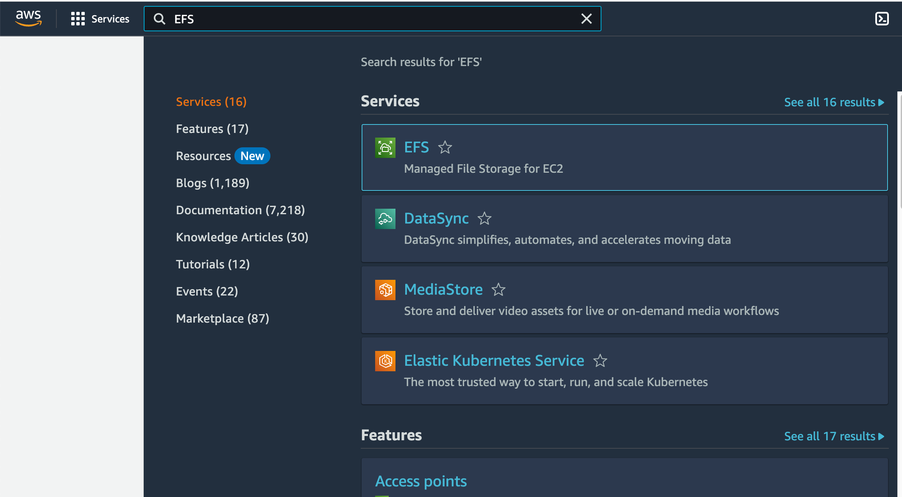
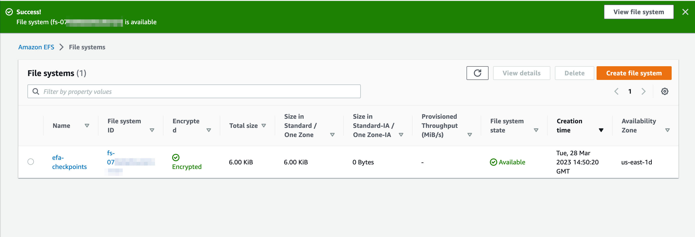
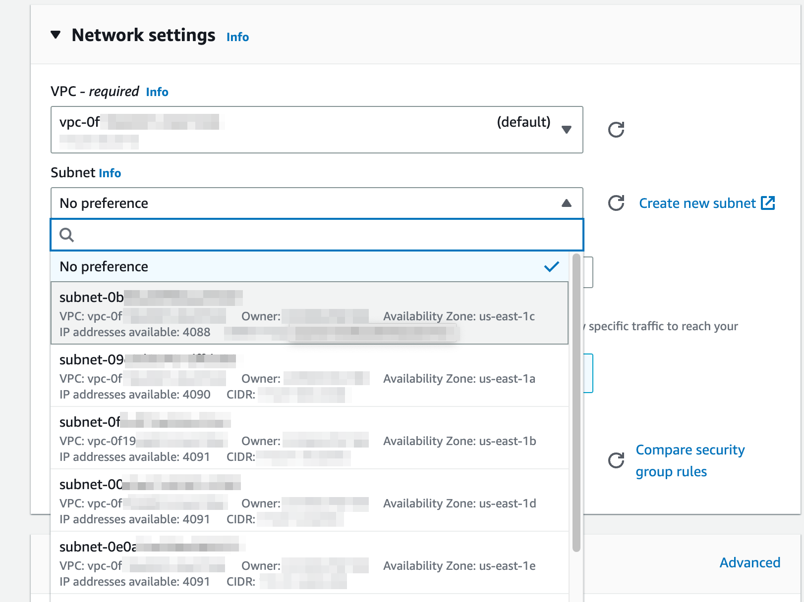
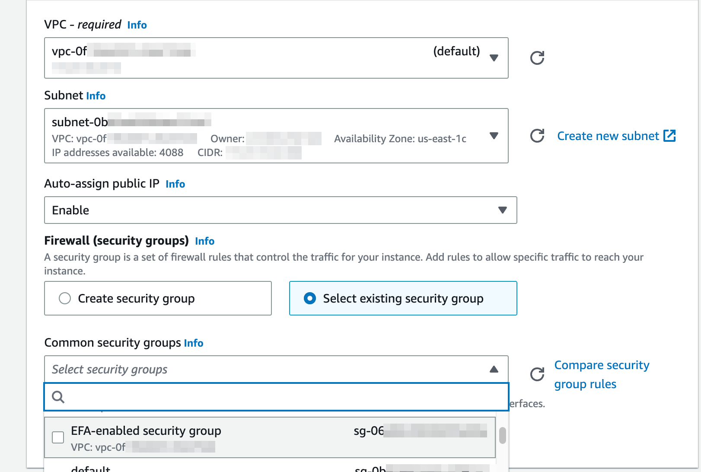
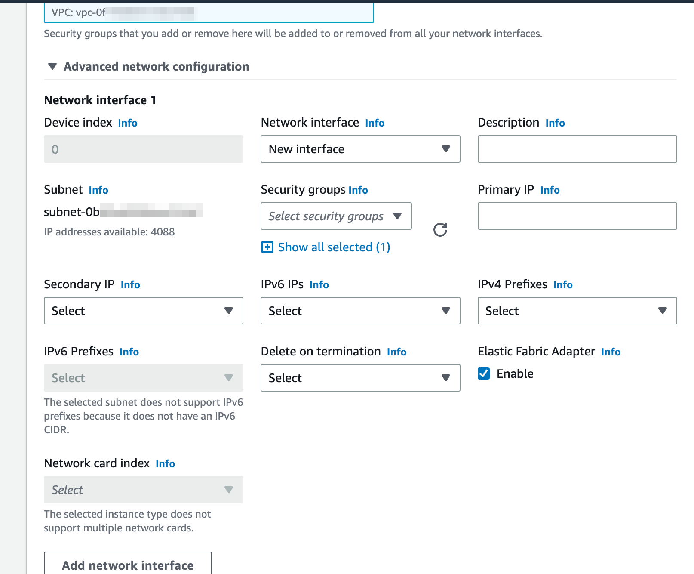
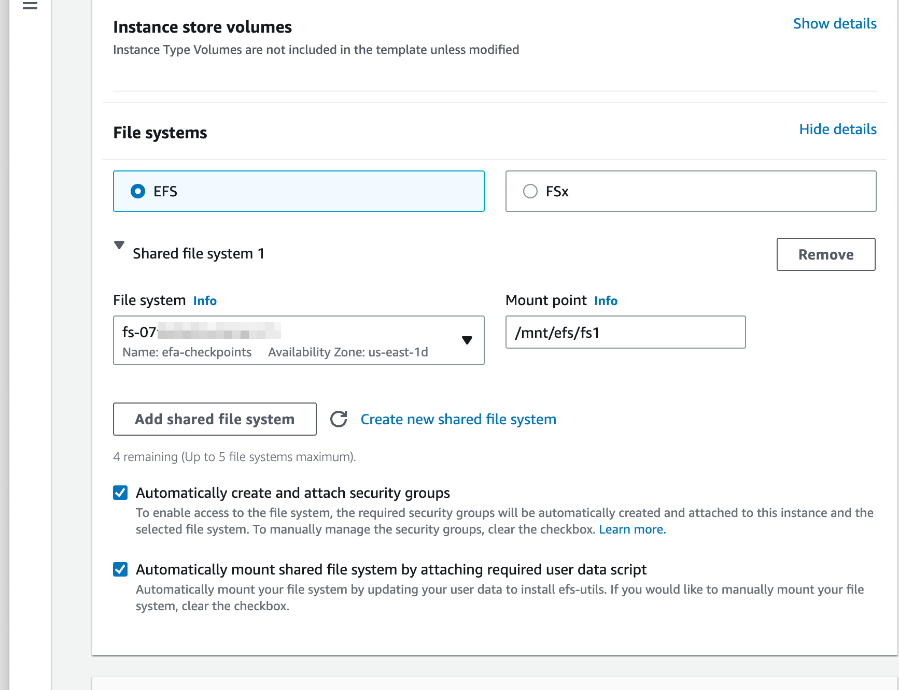

# Fine-Tuning AlexaTM Public Release Models with Elastic Fabric Adapter (EFA)

This setup is based heavily on the latest [EFA guide](https://docs.aws.amazon.com/AWSEC2/latest/UserGuide/efa.html) and particularly the tutorial on [using EFA with NCCL](https://docs.aws.amazon.com/AWSEC2/latest/UserGuide/efa-start-nccl-dlami.html#nccl-start-dlami-sg).

There are 2 ways to create your EFA-enabled cluster.  First, you can stand up one node, and create an AMI,
as in the tutorial above, or you can simply set up multiple instances simultaneously in AWS.
We will do the latter here even though it means following a few more configuration steps directly on each node.

As in the tutorial above, you can run the  [NCCL tests](https://github.com/NVIDIA/nccl-tests) upfront, but this step is not really essential and may be skipped.  Note that you may not use an instance template to create your cluster if you are using EFA.

Fine-tuning in AWS should be done on `p3dn.24xlarge`, or preferably P4 instances (e.g. `p4d.24xlarge`).
Other instance types are not suitable for fine-tuning with EFA.

It is recommended but not required to use a shared file system for training.

This tutorial shows step-by-step configuration of Amazon Elastic File System (EFS).

### Creating a Security Group for use with EFA


To set up EFA, we need a Security Group set up with inbound and outbound traffic allowed for any member of the Security Group.  You will also want inbound traffic on SSH allowed (which is default):

In the EC2 dashboard sidebar, under `Network & Security`, click on `Security Groups` and
then in the top right corner, click on the `Create security group` button.

In the Create security group window, do the following:

For Security group name, enter a descriptive name for the security group, such as EFA-enabled security group.

For VPC, select the VPC into which you intend to launch your EFA-enabled instances.

Choose Create security group.

Set up your inbound and outbound traffic rules as shown below:


### Shared File System (optional)

Using a shared file system makes the process of accessing the model weights, configuration and training data easier, and it makes it simple to 
save and restore checkpoints.  It also means that artifacts of the job may be persisted after the GPU-enabled compute nodes are terminated.

In this document, we will set up an Amazon Elastic File System (EFS) volume that will be shared across training nodes.
This requires a bit more setup, but is not much more complicated, and is recommended, because it makes the processing and handling of results much easier.

To use EFS, first create the file system.  From the AWS console, search for EFS and select the result:



From there, create an EFS store.
In the example below, we know that we are targeting a cluster in a particular availability zone already (since we are using EFA), so we just create a One Zone instance:



### Creating the instances

In the EC2 dashboard, click on the `Launch instance` button.  This will take you to a page titled `Launch an instance`.

Any recent DL AMI should support EFA.  For this tutorial, we assume `Deep Learning AMI GPU PyTorch 1.13.1 (Amazon Linux 2)`
If you want to use another AMI, additional setup steps may be required, or the installation process might vary slightly.

The fine-tuning scripts have been primarily tested on `p3dn.24xlarge` and `p4d.24xlarge` instances.  The `p3dn`s have 32GB of RAM per GPU and the `p4d`
s have 40.  Additionally, the `p4`s have Ampere chips, and can support native `bfloat16` which will make training faster.

Once you select the `Instance type`, you can either select an existing `Key pair` or create one.  This will generate a `.pem` file that we can use for SSH to the boxes.

For the Network Settings, we will need to set our system up with EFA.



Then specify our newly created Security Group:



Then in the advanced networking options, turn on EFA:




#### Without a shared file system
If you are using direct attached storage, your will probably want at least 1024GB per instance (the generated checkpoints are very large).
You can set this value under `Configure storage`.

To access EC2, you may need to attach an IAM role with S3 access to your instance.

Finally, on the right hand panel of the instance creation page, select the number of instances you wish to launch.
For `p3dn.24xlarge`s, at least 3 instances are needed to prevent needing CPU offloading.
For `p4d.24xlarge`s, at least 2 instances are needed.

#### With a shared file system

When we create the instances, we attach the EFS and set a mount point, which will be visible on each instance in the cluster.


Once you have created your EFA-enabled, EFS cluster you can store all of your training data, the model weights and your configuration the mount point.  Note that you may need to adjust the permissions so that the regular ec2-user or ubuntu user can write to the mount.


#### Instance creation troubleshooting

- *Not enough capacity*:  Sometimes you may encounter errors with capacity.  For these, you may try creating your instances in another region or switching instance type (e.g. from `p4d` to `p3dn`).
- *vCPU quota issues*:  You may need to request a *vCPU* quota increase in your target region. The error for that contains a hyperlink that helps you navigate to the self-service request page where you can request more.

### Setting up the instances

Here is a basic rundown of installation for bash using the AMI above.
Assuming you are using direct attached storage, run these commands on all instances.
If you want to use a shared file-system across instances, we have additional documentation [setting up EFS](./EFS.md).

```
git clone https://github.com/amazon-science/alexa-teacher-models.git
conda init bash
echo "source activate pytorch" >> .bashrc
source ~/.bashrc
cd alexa-teacher-models/
pip install -e .[ft]
cd scripts
aws s3 cp --recursive s3://alexa-teacher-models/AlexaTM/AlexaTM-20b-1_0/ AlexaTM-20b-1_0/
aws s3 cp --recursive s3://<your-bucket>/<your-dataset> <your-dataset>
```
If you wish to run `tensorboard`, open up a port in your SecurityGroup for incoming traffic, then `pip install tensorboard` prior to running the fine-tuning code.

Make sure you have a private key setup for your instances.  This would be the PEM when you created your instances.  Here, its named, `id_rsa`.
If you already have a public key, you can skip the first line.

```
chmod 600 id_rsa
ssh-keygen -f id_rsa -y > id_rsa.pub
mv id_rsa ~/.ssh/
mv id_rsa.pub ~/.ssh/
ssh ec2-user@<ip>
```

You need to install [pdsh](https://github.com/chaos/pdsh).  


```
sudo amazon-linux-extras install epel -y
sudo yum install pdsh
```


The *hostfile* is set up private IPs for each of the machines.  You should be able to SSH manually between nodes without having to authenticate.

```
$ cat hostfile 
machine1 slots=8
machine2 slots=8
```

The master node (the node you are running the job from) should be at the top of the file.
Otherwise, you will have to manually pass in `--master_addr machine2` to `deepspeed`.

*Note* If you get errors otherwise compiling fused adam, you may need to put Ninja in a standard area. The steps are [from here](https://github.com/zhanghang1989/PyTorch-Encoding/issues/167)


### Formatting your data

The fine-tuning script supports CSV files, JSON files and pre-procesed HuggingFace Arrow datasets (local and remote).
The input source field can be any name in the dataset, as long as it is passed to the fine-tuning script via `--source_field <name>`.
Similarly, the target field can be any name in the dataset, as long as it is passed via `--target_field`.  The defaulted names are `x` and `y`.

Typically, for AlexaTM, we will want to fine-tune the model to predict the next sequence, given an input sequence (causal modeling).
The model is pretrained with a `[CLM]` token on the front of each sample to tell it to do causal modeling.  For fine-tuning, we typically will want to continue this approach, by passing `--source_prefix "[CLM] "`

### Fine-tuning AlexaTM

The provided fine-tuning script works on HuggingFace datasets from the hub, as well as local file datasets.
After you have prepared your compute instances and datasets, training should work using the following command:


```
deepspeed --hostfile /path/to/hostfile finetune.py \
    --source_prefix "[CLM] " \
    --per_device_train_batch_size 1 \
    --deepspeed deepspeed/zero3.json \
    --model_name_or_path /path/to/AlexaTM-20b-pr/ \
    --max_length 512 --bf16 --output_dir output \
    --gradient_accumulation_steps 2 \
    --source_field src \
    --target_field tgt \
    --max_target_length 64 \
    --do_train --learning_rate 1e-7 \
    --train_file /path/to/train-dir --validation_file /path/to/valid-dir \
    --num_train_epochs 1 --save_steps 100
```


Once the model has run for a bit, you will be able to see performance numbers, and `tensorboard` (if enabled, see below for setup details) will start logging

## Preprocessing the data upfront

We provide the option to tokenize the training data prior to running the fine-tuning script.
Doing this may be advantageous, as it minimizes usage on expensive GPU compute resources for this process.

To run preprocessing upfront, execute the `preproc.py` script:

```

python preproc.py --model_name_or_path /path/to/AlexaTM-20b-pr/ \
    --max_length 512 \
    --max_target_length 64 \
    --source_prefix "[CLM] " \
    --output_dir /path/to/preproc \
    --train_file /path/to/raw/train.json \
    --validation_file /path/to/raw/validation.json

```

After this, the finetune execution script is the same except we add `--is_preproc` and we need to update the input file parameters to point at the preprocessed arrow directories.

## Adding TensorBoard

If you want to add TensorBoard to your configuration, you can allow inbound HTTP traffic in your security group.
If you install using `[ft]`, this will automatically install `tensorboard`.

Once `tensorboard` is installed, you can add `--logging_dir <tensorboard-dir>` to the command above to start seeing TensorBoard events,
and optionally `--logging_steps <log-every-n-steps>`

To run a tensorboard server in your instance:

```
$ sudo /path/to/bin/tensorboard —logdir <tensorboard-dir> —bind_all —port 80
```
*Note* if `tensorboard` is not installed when the job runs, the logging directory will not be generated during fine-tuning.


## Using HuggingFace Example Scripts

It is possible with minimal modifications to use the HuggingFace example scripts with this codebase.

For GPUs with `bfloat16` intrinsic support (e.g. Ampere), its possible to just add

```
import alexa_teacher_models

```

at the top of the script without further modifications.

If you do not have access chips with `bfloat16` support, we recommend using the fine-tuning script provided in this repository.


## References

* https://docs.aws.amazon.com/AWSEC2/latest/UserGuide/efa.html


